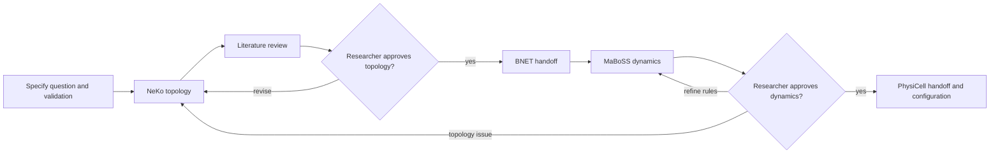

# Biological project agent template

A Claude Code and local Codex workspace for building one traceable biological model
per repository. The main session acts as the scientific orchestrator and delegates
modelling operations to restricted specialist agents for NeKo, MaBoSS, PhysiCell,
and literature review.

The repository stores scientific decisions in files rather than relying on chat
history. It also provides Git-backed commands for checkpointing work, archiving a
model direction, restarting from clean templates, and restoring an earlier model.

For the full design and runtime rationale, see
[`docs/agentic-biomodelling-architecture.md`](docs/agentic-biomodelling-architecture.md).

## What the template provides

- Scientific specification, assumptions, decisions, validation, and data-provenance
  templates.
- Isolated specialist agents with only the tools needed for their modelling stage.
- NeKo network construction and curation with an explicit inference-policy
  contract.
- Edge-level PubMed evidence review, separated by NeKo session.
- MaBoSS simulation, mutation analysis, and explicitly gated rule refinement.
- PhysiCell and PhysiBoSS configuration from an approved MaBoSS handoff.
- Typed, review-gated handoffs between modelling stages.
- Durable MCP session and artifact provenance.
- Local Git checkpoints during model development.
- Named model archives and automatic recovery points.
- Safe, path-scoped restart and restore operations.

## Current implementation status

Four specialist agents are currently included:

| Agent | Purpose | MCP access |
|---|---|---|
| `network-curator` | Construct, inspect, curate, compare, and export NeKo networks | Inline NeKo server only |
| `literature-reviewer` | Review evidence for edges and assumptions and write edge reports | Configured `pubmed` server |
| `boolean-dynamics-modeler` | Import NeKo handoffs, run MaBoSS analyses, mutations, and bounded rule refinement | Inline MaBoSS server only |
| `multicellular-configurator` | Configure PhysiCell/PhysiBoSS domains, cells, substrates, rules, and mappings | Inline PhysiCell server only |

The architecture also describes an independent scientific reviewer and a
reproducibility auditor. Their agent definitions are not yet included. Consequently,
the `/validate-stage` skill describes the intended validation workflow but cannot
complete it until those two agents are implemented.

The three modelling specialists start isolated inline MCP servers. The literature
specialist still requires a configured literature server. Availability depends on
your local installation.

## Prerequisites

- Git
- Python 3
- Claude Code with custom agents and skills enabled
- A modelling environment containing the NeKo, MaBoSS, and PhysiCell MCP executables
- An optional PubMed MCP server for literature review

The inline NeKo, MaBoSS, and PhysiCell commands must point to executables installed
in the modelling environment. Typical locations are:

```text
<MODELLING_ENV>/bin/mcp-neko-server              # Linux/macOS
<MODELLING_ENV>/Scripts/mcp-neko-server.exe      # Windows
```

The agents inherit whichever model is running the main Claude Code session. The
remote Ollama/Qwen setup described in the architecture document is supported but is
not required by the repository structure.

## Initial setup

1. Clone the repository and enter it:

   ```powershell
   git clone <repository-url> my-biological-model
   cd my-biological-model
   ```

2. Edit the inline `command`, `CONDA_PREFIX`, and `PATH` values in these files so
   they point to your modelling environment:

   - `.claude/agents/network-curator.md`
   - `.claude/agents/boolean-dynamics-modeler.md`
   - `.claude/agents/multicellular-configurator.md`

   The tracked values are the paths for the current Linux/WSL workstation. On
   another machine, use `<env>/bin/mcp-…-server` on Linux/macOS or
   `<env>/Scripts/mcp-…-server.exe` on Windows. Do not put `${...}` placeholders in
   `command`; inline command values are executed directly rather than by a shell.

3. Configure an external MCP server named `pubmed` if literature review will be
   used. The name must match the agent definition.

4. Start Claude Code from the repository root.

5. Run `/agents` and confirm the four tracked agents are visible. Run `/mcp` to
   check the optional PubMed connection. The three modelling servers are scoped to
   their subagents and start only when those agents run.

6. Ask the orchestrator to help populate the scientific-state files. If you have
   experimental data, place the original inputs under `inputs/` and describe their
   identifiers, units, and provenance in `DATA_DICTIONARY.md`.

7. Commit the initial project and lifecycle infrastructure before using archive,
   restart, or restore commands.

The modelling specialists define their servers inline, restrict their callable
toolsets, and preload versioned workflow skills from `.claude/skills/`. This avoids
Claude Code's unavailable MCP-resource bridge in background subagents and prevents
the orchestrator from receiving the modelling MCP tools.

## Codex / ChatGPT Work

The Codex port is additive: Claude continues to use `.claude/`, while Codex reads
`AGENTS.md`, loads the repository plugin, and launches each specialist in a separate
process. Codex 0.153.0 is the minimum supported CLI version.

This workflow requires a local Codex client, such as the Codex extension in VS
Code, because NeKo, MaBoSS, and PhysiCell are local stdio MCP servers. A hosted
Workspace Agent cannot reach those processes or local files unless they are
separately exposed through approved infrastructure; this repository neither
creates nor authorizes that exposure.

### Local setup

1. Open the repository root in VS Code under WSL (or another local environment
   containing the modelling executables) and fully reload the window after Codex
   configuration changes.
2. Copy each example from `.codex/profiles/` to the exact user-local filename shown
   in `.codex/profiles/README.md`. Add the complete transport only to the matching
   profile. Never commit those files.
3. Register and install the repository-local plugin if it is not already visible:

   ```text
   codex plugin marketplace add .
   codex plugin add agentic-system-for-modelling@agentic-modelling-local
   codex plugin marketplace list
   codex plugin list
   ```

   The marketplace manifest is `.agents/plugins/marketplace.json`; the plugin source
   and `.codex-plugin/plugin.json` manifest remain in this repository. Installation
   copies the package into the user-local Codex cache, so reinstall after changing
   plugin skills when testing the installed copy.
4. Run the non-mutating preflight:

   ```text
   python scripts/codex/check_environment.py --allow-web-search
   ```

   Omit `--allow-web-search` when literature searches must use only a configured
   PubMed MCP. A healthy result reports the orchestrator with no enabled modelling
   MCP and each modelling specialist with exactly its own server.

Ask Codex to “inspect the durable model state and recommend the next permitted
stage” to invoke the orchestrator. Do not select the same-process files under
`.codex/agents/`; they are inactive compatibility examples because Codex 0.153.0
cannot enforce per-child MCP isolation there.

For a bounded specialist task, place its text under the ignored, writable
`.codex-tasks/` directory. Do not use `.codex/tasks/`: Codex clients may protect the
`.codex/` configuration directory as read-only. Use the sole supported entry point:

```text
python scripts/codex/run_specialist.py network_curator --prompt-file .codex-tasks/network.txt
python scripts/codex/run_specialist.py literature_reviewer --prompt-file .codex-tasks/literature.txt --record-session-id <neko-session-id> --allow-web-search
python scripts/codex/run_specialist.py boolean_dynamics_modeler --prompt-file .codex-tasks/maboss.txt
python scripts/codex/run_specialist.py multicellular_configurator --prompt-file .codex-tasks/physicell.txt
```

After an invocation is recorded, the launcher verifies the prompt digest and its
stored `task.txt`, then removes the recognized source task. Interrupted or
unrecorded prompts are retained. Preview and clean verified leftovers—including
legacy root `.codex-task-*.txt` files—during checkpointing:

```text
python scripts/codex/cleanup_tasks.py
python scripts/codex/cleanup_tasks.py --apply
```

The cleanup command never deletes an unmatched prompt.

Use repeated `--approve-tool <tool-name>` arguments only for exact modelling writes
already authorized for that invocation. Destructive cleanup tools cannot be
approved by the launcher. For Windows-to-WSL routing, copy
`.codex/launcher.example.json` to the ignored `.codex/launcher.local.json`, fill in
local values, and add `--transport wsl` to the same command.

Literature review prefers a complete `pubmed` transport in the ignored user-local
literature profile. Otherwise it uses hosted search only when
`--allow-web-search` is present; parent ChatGPT web access is never assumed. Search
is limited to primary biomedical sources, and reports distinguish metadata,
abstract-only review, and retrieved full text. With neither backend, the launcher
records a typed `blocked` handoff. The optional structured NCBI MCP is not bundled.

Claude's `PreToolUse` hook is not the Codex write boundary. The Codex literature
subprocess is read-only, and the orchestrator sends each returned draft through
`scripts/codex/write_literature_report.py`, which validates its exact session path,
headings, verdict, confidence, and PMID/DOI fields and refuses overwrites. See
`docs/codex-phase4-enforcement.md` for the enforcement mapping.

### Claude-to-Codex mapping

| Claude implementation | Codex implementation |
|---|---|
| `CLAUDE.md` | `AGENTS.md` |
| `.claude/agents/*.md` inline specialists | Separate processes through `scripts/codex/run_specialist.py`; `.codex/agents/*.toml.example` are inactive |
| `.claude/skills/*/SKILL.md` | Repository plugin skills under `skills/*/SKILL.md` |
| Claude inline MCP transports | Ignored user-local profiles based on `.codex/profiles/*.example` |
| `literature_file_guard.py` hook | Read-only specialist plus `write_literature_report.py` |
| Agent result conventions | `validate_handoff.py` provider-neutral JSON schema |
| Manual environment inspection | `check_environment.py` sanitized preflight |

### Codex troubleshooting

- If a WSL launch fails, confirm every value in `.codex/launcher.local.json`, run
  the configured Python and Codex executables directly inside that distribution,
  and keep task paths repository-relative.
- If a specialist reports a missing MCP, verify its ignored user-local profile and
  rerun `check_environment.py`. Never put the local executable path in tracked
  configuration.
- If an MCP configuration changed but inventory is stale, fully reload VS Code and
  start a fresh Codex session before retesting.
- If a recorded session ID no longer exists in a restarted MCP process, treat it as
  provenance only and reconstruct runtime state from the validated handoff and
  artifacts. Do not silently reuse a different live session.
- If task prompts remain after checkpointing, run `cleanup_tasks.py` without
  `--apply` and inspect the `unmatched` reasons. A missing recorded invocation is a
  provenance problem, not permission to delete the prompt.
- The ChatGPT Windows parent is unsupported unless an external policy can
  mechanically prove it has no modelling MCP tools. The WSL bridge isolates the
  child process but cannot remove tools already granted to the parent app.

## Repository state files

These files are the scientific sources of truth:

| Path | Contents |
|---|---|
| `MODEL_SPEC.md` | Biological question, scope, entities, mechanisms, model form, inputs, outputs, and limitations |
| `DATA_DICTIONARY.md` | Identifiers, biological meanings, units, sources, and versions |
| `ASSUMPTIONS.md` | Explicit assumptions, evidence, status, and consequences if false |
| `DECISIONS.md` | Accepted and rejected modelling decisions with rationale and approval |
| `CURRENT_STATE.md` | Active stage, specialist session registry, artifacts, conclusions, warnings, and next action |
| `VALIDATION_PLAN.md` | Criteria, methods, required evidence, status, and results |
| `inputs/` | User-supplied source data; preserved across restart and restore |
| `evidence/` | Literature queues and versioned edge-level evidence reports |
| `runs/` | Immutable or reproducible artifacts grouped by specialist session ID |
| `memory/` | Durable project notes needed across Claude contexts |
| `src/` | Project-specific analysis or model code |

Chat history and Claude auto-memory are not authoritative scientific records. Record
every material assumption, accepted decision, session ID, handoff, and artifact in
the repository.

## Recommended modelling workflow



### 1. Specify the scientific problem

Describe the biological objective to the orchestrator. Establish system boundaries,
observables, inputs, units, assumptions, candidate alternatives, and validation
criteria before fitting or interpreting a model.

Example:

```text
I want to model how EGFR inhibition changes apoptosis in this cell type. Help me
complete the specification and identify the decisions that need my approval.
```

### 2. Construct and curate the signalling network

The orchestrator delegates NeKo work to `network-curator`. Each independent
hypothesis gets a fresh NeKo session. Before construction or connection repair, the
agent explicitly reports the effective `path_policy`, `reuse_policy`, `max_len`,
`only_signed`, and `consensus` choices.

Read-only inspection is autonomous. Topology mutations require an explicit task
instruction. SIF files may be exported for review, while BNET and the typed MaBoSS
handoff remain gated until the topology has been reviewed and approved.

### 3. Review literature evidence

The orchestrator can delegate candidate edges to `literature-reviewer`. Reports are
written to:

```text
evidence/reports/<neko_session_id>/<source>__<target>.md
```

The reviewer has deliberately constrained write access: it can create report files
under `evidence/reports/`, but it cannot write elsewhere in the project or edit
model state, decisions, topology artifacts, or shared manifests. A path guard
validates every Read and Write call, creates the report's parent directory when
needed, and rejects traversal or symlink escapes from the report directory.

The reviewer separates evidence for interaction existence, direction, sign,
directness, and biological context. Gathering evidence may happen autonomously;
changing the topology based on that evidence still requires researcher approval.

### 4. Simulate Boolean dynamics

After an approved NeKo BNET handoff, `boolean-dynamics-modeler` creates a fresh
MaBoSS session, selects relevant outputs and initial states, runs the wild type and
requested mutations under matched parameters, and reports artifacts and warnings.

Logical rules are not changed automatically. Rule refinement is available only when
you explicitly name the nodes to refine and point to a target in
`VALIDATION_PLAN.md`. The search is restricted to each node's existing regulators,
and all tested variants must be reported. Final rules are labelled either
`literature-derived` or `fitted-for-dynamics` in `DECISIONS.md`.

### 5. Configure the multicellular model

After an approved MaBoSS handoff, `multicellular-configurator` can define the
PhysiCell domain, substrates, cell types, Cell Rules, and PhysiBoSS mappings. Units
and parameter values must come from supplied data, literature, or explicitly
approved hypotheses.

The current PhysiCell MCP integration generates and validates configuration; it does
not execute a PhysiCell simulation.

### 6. Record and checkpoint progress

At each stage transition, update the state files and invoke:

```text
/checkpoint-model
```

This skill checks provenance, stages only relevant paths, creates a local commit,
and records the content-checkpoint commit in `CURRENT_STATE.md`. Use it before
`/compact`, `/clear`, or ending an important working session. Checkpoints are
allowed only on a dedicated local branch named `model/<name>`; the skill reports
the current branch and refuses to commit on `main` or a detached HEAD.

## Available skills and commands

| Command | Effect | Mutates files or Git? |
|---|---|---|
| `/checkpoint-model` | Save a validated stage checkpoint in local Git history | Yes |
| `/review-literature-evidence` | Apply the structured evidence-review procedure | Only through the assigned reviewer output |
| `/validate-stage` | Coordinate scientific and reproducibility review | Intended feature; currently awaits two agent definitions |
| `/model-list` | Show the current model attempt and named archives | No |
| `/model-list --all` | Also show automatic recovery points | No |
| `/model-archive <name>` | Commit and tag the current model state | Yes |
| `/model-restart` | Preview, confirm, archive, and reset model state | Yes |
| `/model-restore <name>` | Preview, confirm, verify, and restore an archived state | Yes |
| `/agents` | Inspect the agents available to Claude Code | No |
| `/mcp` | Inspect configured MCP servers | No |
| `/clear` | Clear conversational context after durable state is saved | No repository change |
| `/compact` | Compact the conversation after a checkpoint | No repository change |

Lifecycle commands are user-invoked only. The orchestrator must not autonomously
archive, restart, or restore a model.

## Model lifecycle examples

This repository represents one model, but that model can have multiple attempted
directions over time.

### Save a named direction

```text
/model-archive baseline-egfr-apoptosis
```

This creates a normal Git commit, an integrity manifest, and an annotated tag such
as `model/archive/baseline-egfr-apoptosis`. It does not restart the model.

### Abandon the current direction and start clean

```text
/model-restart
```

The command first shows exactly which scientific-state paths will be reset. After
you confirm, it creates an automatic `model/recovery/*` tag and replaces configured
state with pristine files from `templates/`. Then run:

```text
/clear
```

This prevents assumptions from the previous conversation contaminating the new
attempt.

### Inspect saved states

```text
/model-list
/model-list --all
```

The first command shows named archives. The second also shows recovery points made
automatically before restart and restore operations.

### Resume an archived direction

```text
/model-restore baseline-egfr-apoptosis
```

The command verifies the archive manifest, previews the affected paths, and asks for
confirmation. It then saves the current state as another recovery point and restores
the selected scientific state. Run `/clear` before continuing the restored model.

`/model-restore` deliberately replaces the originally proposed `/checkout` command:
it restores only model-state paths and never switches branches, resets Git history,
or rolls agent configuration back to an older version.

## What restart and restore affect

The authoritative allowlist is [`.model/config.json`](.model/config.json).

Restart and restore can replace:

- the six scientific-state Markdown files;
- `evidence/`;
- `memory/`;
- `runs/`; and
- `src/`.

They preserve:

- `.claude/` agent, skill, and permission configuration;
- `.model/` lifecycle configuration and archive registry;
- `inputs/` source data;
- `templates/`;
- `docs/`;
- `CLAUDE.md`; and
- this README.

Before a mutating lifecycle command, the script refuses to proceed when:

- lifecycle infrastructure or templates are uncommitted;
- the Git index already contains staged work;
- a merge, rebase, cherry-pick, or revert is active;
- Git author identity is missing;
- ignored files exist inside model-state paths; or
- model-state paths contain symlinks.

These checks prevent a reset from silently losing state that Git cannot recover.

## Git behavior and remote backup

There are two complementary forms of history:

- A checkpoint is a progress commit within the current modelling attempt.
- An archive is a named, integrity-checked snapshot intended for later restoration.

Lifecycle operations use linear commits and annotated tags. They do not create or
switch branches, rewrite history, delete artifacts, or push to a remote. Everything
remains local unless you explicitly use Git to publish it. Mutating lifecycle
commands require a dedicated branch named `model/<name>` and fail before staging
anything when run on a development branch or detached HEAD.

If remote backup is appropriate, first review the repository for sensitive or large
biological data, then explicitly push commits and tags according to your project's
data-governance policy. Files under `inputs/` are preserved locally but are not
automatically excluded from Git.

## MCP sessions and restored models

A Git archive can restore session IDs, handoff files, reports, and generated
artifacts. It cannot resurrect an in-memory MCP server process. After restoring a
model, specialist agents treat recorded session IDs as provenance and reconstruct
runtime state from the stored handoffs and artifacts when necessary.

NeKo, MaBoSS, and PhysiCell each maintain their own session identifier. There is no
single pipeline-wide run ID. `CURRENT_STATE.md` must record which upstream session
produced every downstream handoff.

## Safety and scientific decision boundaries

- The orchestrator delegates modelling operations; it does not call NeKo, MaBoSS,
  or PhysiCell directly.
- Specialist agents ask the orchestrator for consequential clarification rather
  than guessing or questioning the user directly.
- Network topology changes, conclusive handoff exports, and unrequested logical-rule
  changes are gated decisions.
- Units and parameter values are never invented silently.
- Successful software execution is not treated as scientific validation.
- Evidence, assumptions, outputs, and conclusions remain separate.
- Specialist sessions and artifacts are not deleted without explicit approval.

## Troubleshooting

### An agent is missing

Run `/agents`. Ensure its Markdown file exists under `.claude/agents/` and restart
Claude Code if the repository configuration was changed after launch.

### NeKo, MaBoSS, or PhysiCell does not start

Inspect the inline `command`, `CONDA_PREFIX`, and `PATH` values in the corresponding
file under `.claude/agents/`. Confirm that the executable exists and that the
installed `mcp-biomodelling-servers` version matches the workflow-skill snapshot.
Restart Claude Code after changing an inline server command or upgrading the
environment.

### A literature reviewer report write is rejected

The reviewer is allowed to write Markdown evidence reports below
`evidence/reports/`; it is not a globally read-only agent. It uses
`.claude/scripts/literature_file_guard.py` to enforce that boundary and does not
require `jq`. The guard also creates a validated report's parent directory before
the Write runs.

Read the guard's error message first:

- `Write is allowed only below .../evidence/reports` means the agent generated an
  incorrect or unsafe output path. Confirm that the task includes the correct
  `neko_session_id` and that the requested path follows the report layout.
- `do not Read literature_queue.json or .sif files in full` means the reviewer must
  use Grep for the relevant edge lines, as required by its definition.
- `invalid hook JSON input`, a missing field, or a directory-creation error indicates
  a hook/runtime problem rather than a PubMed failure.

Confirm that `python` is available in the environment used to launch Claude Code,
then run the focused regression tests:

```powershell
python .claude/scripts/test_literature_file_guard.py -v
```

For full hook diagnostics, launch Claude Code with
`claude --debug-file claude-debug.log`, reproduce the failed reviewer call, and
inspect the matching `PreToolUse:Read` or `PreToolUse:Write` entry.

### PubMed is unavailable

Run `/mcp` and confirm a server with the exact name `pubmed` is configured. Its
source repository and release process are external to this template.

### A lifecycle command refuses to run

Read the reported preflight error. Usually the remedy is to commit lifecycle
infrastructure, commit or unstage existing staged changes, finish an active Git
operation, or move ignored generated files outside configured model-state paths.
Do not bypass the check by deleting scientific artifacts.

### Test the lifecycle implementation

Run the isolated end-to-end test:

```powershell
python .claude/scripts/test_model_lifecycle.py -v
```

The test creates a disposable Git repository and exercises archive, restart,
recovery, manifest verification, input preservation, and restore without modifying
the active model.

## Further documentation

- [Architecture and runtime deployment](docs/agentic-biomodelling-architecture.md)
- [Subagent workflow diagram](docs/subagent-workflow.mmd)
- [Runtime deployment diagram](docs/runtime-deployment.mmd)
- [Lifecycle configuration](.model/config.json)
- [Main orchestrator policy](CLAUDE.md)

This template configures agents and project workflows. It does not modify or release
the NeKo, MaBoSS, PubMed, or PhysiCell MCP server source repositories.
