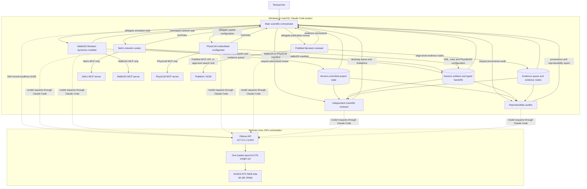
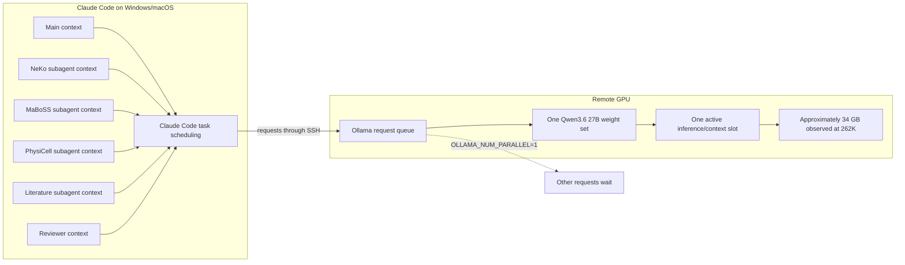

# Agentic Bio-Modelling Project Architecture

**Scope:** biological project repositories using Claude Code, NeKo, MaBoSS, PhysiCell, PubMed review, and a remote Ollama/Qwen backend.

## 1. Purpose

This design separates scientific orchestration, model construction, evidence review, validation, and reproducibility. The main Claude Code session remains the scientific orchestrator. Specialist subagents receive isolated contexts and only the MCP servers or read-only tools needed for their role.

The recommended roles are:

- NeKo network curator
- MaBoSS Boolean-dynamics modeler
- PhysiCell multicellular configurator
- PubMed literature reviewer
- Independent scientific reviewer
- Reproducibility auditor

The chat is not the authoritative scientific record. Version-controlled project files, run manifests, typed handoffs, and session artifacts are.

## 2. Verified runtime setup

```text
Windows or macOS
├── Claude Code
├── Main orchestration context
├── Isolated subagent contexts
├── Local stdio MCP servers
│   ├── NeKo
│   ├── MaBoSS
│   └── PhysiCell
└── SSH tunnel: 127.0.0.1:11435
             │
             ▼
Remote Linux workstation
├── Ollama: 127.0.0.1:11434
├── qwen3.6:27b
├── context: 262,144 tokens
└── NVIDIA RTX 6000 Ada, approximately 48 GB VRAM
```

Observed for `qwen3.6:27b`:

- 100% GPU execution
- approximately 34 GB GPU allocation with the full context
- approximately 15 GB remaining VRAM
- MCP tools successfully loaded on demand in Claude Code
- fresh Claude Code context reduced from roughly 26% to roughly 6%

Recommended Claude Code environment:

### Windows PowerShell

```powershell
$env:ANTHROPIC_AUTH_TOKEN = "ollama"
$env:ANTHROPIC_API_KEY = ""
$env:ANTHROPIC_BASE_URL = "http://127.0.0.1:11435"
$env:ENABLE_TOOL_SEARCH = "true"
$env:CLAUDE_CODE_MAX_CONTEXT_TOKENS = "262144"
$env:CLAUDE_CODE_AUTO_COMPACT_WINDOW = "220000"
claude --model qwen3.6:27b
```

### macOS

```bash
export ANTHROPIC_AUTH_TOKEN="ollama"
export ANTHROPIC_API_KEY=""
export ANTHROPIC_BASE_URL="http://127.0.0.1:11435"
export ENABLE_TOOL_SEARCH="true"
export CLAUDE_CODE_MAX_CONTEXT_TOKENS="262144"
export CLAUDE_CODE_AUTO_COMPACT_WINDOW="220000"
claude --model qwen3.6:27b
```

Recommended Ollama settings:

```bash
export OLLAMA_CONTEXT_LENGTH="262144"
export OLLAMA_NUM_PARALLEL="1"
export OLLAMA_MAX_LOADED_MODELS="1"
export OLLAMA_MAX_QUEUE="8"
```

## 3. How subagents work

### 3.1 Logical agent versus model copy

A subagent is a new logical Claude Code agent invocation with its own:

- isolated context window
- custom agent prompt
- delegated task
- tool and MCP-server permissions
- turn limit
- transcript
- optional persistent memory

With `model: inherit`, every specialist uses the main session model, here `qwen3.6:27b`.

At the Claude Code level, each subagent is a separate agent instance. At the Ollama/GPU level, it is normally another request to the same loaded Qwen model, not another complete 27B weight copy.

### 3.2 Where state lives

```text
Local Windows/macOS machine
├── main transcript
├── subagent transcripts
├── project files
├── agent definitions
├── skills
└── MCP processes

Remote Linux GPU machine
└── Ollama
    ├── one loaded Qwen3.6 weight set
    └── active inference/context memory
```

The durable conversation state belongs to Claude Code on the local machine. Ollama receives inference requests through the SSH tunnel.

### 3.3 Context windows

Each normal custom subagent starts with a fresh isolated context. It does not receive the main conversation transcript. Its startup context includes its agent prompt, delegated task, project `CLAUDE.md`, applicable rules, and any preloaded skills.

This provides context isolation: literature searches, network inspection, simulations, and review work do not fill the orchestrator context.

A separate logical context does not mean every historical subagent permanently holds a full 262K KV cache in VRAM. Claude Code stores transcripts locally and sends model requests as needed. Ollama manages active inference memory.

### 3.4 Parallel subagents

Claude Code supports foreground and background subagents. Multiple tasks can exist concurrently, but subagents cannot spawn further subagents. The main orchestrator performs all delegation.

With `OLLAMA_NUM_PARALLEL=1`:

- several subagent tasks may be alive
- only one Qwen model request is processed at a time
- other model requests queue
- CPU modelling, database queries, file operations, and PubMed access can overlap

This is the safe policy for the current 48 GB GPU. Ollama documents that memory for parallel processing scales with `OLLAMA_NUM_PARALLEL × OLLAMA_CONTEXT_LENGTH`. A second full-context slot is not recommended given the observed 34 GB use for one slot.

### 3.5 Useful concurrency with one inference slot

```text
NeKo agent plans with Qwen
    ↓
NeKo MCP performs CPU/database work
    ↓
Literature agent uses Qwen
    ↓
PubMed query runs
    ↓
MaBoSS agent uses Qwen
    ↓
MaBoSS simulation runs on CPU
    ↓
Scientific reviewer uses Qwen
```

Only inference is serialized.

## 4. Recommended project repository

```text
biological-project/
├── CLAUDE.md
├── CLAUDE.local.md
├── MODEL_SPEC.md
├── DATA_DICTIONARY.md
├── ASSUMPTIONS.md
├── DECISIONS.md
├── CURRENT_STATE.md
├── VALIDATION_PLAN.md
│
├── .claude/
│   ├── agents/
│   │   ├── network-curator.md
│   │   ├── boolean-dynamics-modeler.md
│   │   ├── multicellular-configurator.md
│   │   ├── literature-reviewer.md
│   │   ├── scientific-reviewer.md
│   │   └── reproducibility-auditor.md
│   └── skills/
│       ├── checkpoint-model/SKILL.md
│       ├── review-literature-evidence/SKILL.md
│       └── validate-stage/SKILL.md
│
├── docs/
│   ├── agentic-biomodelling-architecture.md
│   ├── subagent-workflow.mmd
│   └── runtime-deployment.mmd
│
├── inputs/
├── evidence/
│   ├── literature_queue.json
│   ├── evidence_matrix.json
│   └── literature_review.md
├── runs/
│   ├── index.json
│   └── run-0001/
│       ├── manifest.json
│       ├── assumptions.md
│       ├── decisions.md
│       ├── summary.md
│       ├── diagnostics.json
│       ├── operation_log.jsonl
│       └── artifacts/
└── src/
```

Auto-memory is machine-local and may help with convenience, but scientific state must be committed to project files.

## 5. Full workflow diagram



Subagents do not directly command each other. The orchestrator coordinates them. Project files and typed artifacts carry state between stages.

## 6. Runtime model-sharing diagram



## 7. Roles

### Main scientific orchestrator

- clarifies the biological question
- delegates bounded tasks
- reconciles specialist findings
- requests human decisions
- controls stage transitions
- records accepted conclusions
- invokes independent review
- maintains durable state
- avoids directly mutating models when a specialist exists

### NeKo network curator

- MCP access: NeKo only
- reads `docs://neko/agent_manual`
- creates one session per hypothesis
- builds and curates signalling networks
- inspects evidence and topology
- scouts connectivity repairs before mutation
- preserves network-history alternatives
- creates a literature evidence queue
- exports the verified NeKo-to-MaBoSS handoff

### MaBoSS Boolean-dynamics modeler

- MCP access: MaBoSS only
- reads `docs://maboss/agent_manual`
- imports the verified NeKo handoff
- inspects exact Boolean node names
- selects biologically meaningful output nodes
- states parameter and initial-state assumptions
- compares wild type and mutations
- reports stability and state-space risks
- exports the verified MaBoSS-to-PhysiCell handoff

### PhysiCell multicellular configurator

- MCP access: PhysiCell only
- reads `docs://physicell/agent_manual`
- imports the verified MaBoSS handoff
- defines domains, substrates, cell types, and rules
- makes every signal-node-behavior mapping explicit
- records units and assumptions
- exports Cell Rules before XML when required
- never claims that configuration generation equals successful simulation

### Literature reviewer

- access: PubMed/NCBI MCP, API wrapper, or approved search tools
- does not mutate model state
- reviews PMIDs supplied by NeKo and performs targeted searches
- separates direct and indirect evidence
- records organism, tissue, cell type, disease context, perturbation, and study type
- evaluates edge existence, direction, and sign separately
- records conflicting evidence and abstract-only limitations
- returns a structured evidence matrix

A Skill describes the review method but does not itself provide network access. The agent still needs a PubMed/NCBI search tool.

### Independent scientific reviewer

- read-only
- challenges assumptions, circular reasoning, confounding, identifiability, output selection, parameter sensitivity, unsupported mappings, missing controls, and excessive claims
- returns blocking issues, limitations, optional improvements, and a proceed/revise/stop recommendation

### Reproducibility auditor

- read-only
- checks session IDs, manifests, hashes, package versions, database provenance, parameters, initial states, mutations, mappings, handoff lineage, warnings, failed alternatives, and reconstructability

## 8. Scientific stages

### Stage 0: specification

The orchestrator defines the question, variables, units, mechanisms, alternatives, and validation criteria. Human confirmation is required before expensive modelling.

### Stage 1: NeKo and literature

1. spawn network curator
2. build and inspect network
3. create literature evidence queue
4. spawn literature reviewer, optionally in background
5. return disputed edges to NeKo curator
6. run scientific review
7. approve network checkpoint
8. export typed handoff

### Stage 2: MaBoSS

1. spawn Boolean-dynamics modeler
2. import verified handoff
3. choose outputs
4. configure assumptions
5. run wild type and mutations
6. run scientific review
7. record conclusions and limitations
8. export typed handoff

### Stage 3: PhysiCell

1. spawn multicellular configurator
2. import verified handoff
3. configure spatial and cellular model
4. run scientific review
5. export configuration artifacts
6. run reproducibility audit

### Stage 4: checkpoint

The checkpoint skill records sessions, artifacts, hashes, parameters, warnings, decisions, and next actions before compaction or session exit.

## 9. Context policy

Main context should contain scientific synthesis and decisions. Subagent contexts should contain specialist exploration and large tool outputs. Durable files should contain exact state.

Large MCP responses should return summaries and artifact paths rather than complete datasets, logs, matrices, or XML.

Before `/compact` or `/clear`, invoke the checkpoint skill.

## 10. Parallelism policy

| Agent | Recommended mode |
|---|---|
| NeKo | foreground |
| MaBoSS | foreground |
| PhysiCell | foreground |
| Literature reviewer | background when independent |
| Scientific reviewer | background after artifacts exist |
| Reproducibility auditor | background after checkpoint |

Background does not imply simultaneous GPU inference when `OLLAMA_NUM_PARALLEL=1`; requests are queued.

Do not enable `OLLAMA_NUM_PARALLEL=2` without realistic long-context testing and VRAM monitoring.

## 11. MCP allocation

Simplest arrangement: keep MCP servers configured for the project and restrict each subagent with `mcpServers`.

Stronger isolation: define the relevant MCP server inline in each project subagent so the main orchestrator cannot invoke it. Adopt this only after the simple configuration is stable on Windows and macOS.

## 12. Failure rules

- never silently reuse a previous session
- never ignore a tool error
- never let a literature agent directly mutate NeKo
- never accept an invalid handoff
- never equate successful execution with scientific validity
- never delete artifacts without approval
- checkpoint partial results when an agent reaches its turn limit
- retry background tasks in the foreground if permissions are needed
- reduce background work if the Ollama queue overloads

## 13. Implementation order

1. add `CLAUDE.md`
2. add six subagent definitions
3. verify exact MCP names with `/mcp`
4. replace the placeholder `pubmed` server name
5. fill scientific-state files
6. test a small NeKo task
7. test evidence queue and literature matrix
8. test MaBoSS handoff
9. test independent review
10. add checkpoint and validation skills
11. test a complete small NeKo-to-MaBoSS workflow
12. add PhysiCell after earlier stages are stable

## 14. Official documentation

- Claude Code subagents: https://code.claude.com/docs/en/sub-agents
- Claude Code project memory and CLAUDE.md: https://code.claude.com/docs/en/memory
- Claude Code skills: https://code.claude.com/docs/en/slash-commands
- Claude Code hooks: https://code.claude.com/docs/en/hooks
- Claude Code sessions: https://code.claude.com/docs/en/sessions
- Ollama concurrency: https://docs.ollama.com/faq

Re-check these sources after major Claude Code or Ollama upgrades.
