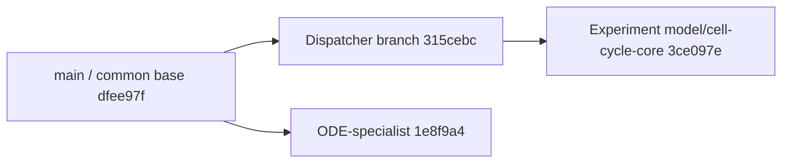

# Dispatcher and ODE branch comparison

Date: 17 September 2026. Scope: branch history, software architecture, contracts, skills, setup and tests. No scientific work, branch switch, integration or cleanup was performed.

## Conclusion

Your interpretation of the experiment branch is correct. There are two independently developed ODE integrations, and the dedicated `ODE-specialist` branch is substantially more complete as an ODE workflow. The dispatcher branch is the stronger execution foundation. The experiment supplies live modelling evidence, a dispatcher-connected ODE route and several useful fixes.

**Recommended direction for discussion:** start future integration from `codex/specialist-dispatcher` in a separate working directory; adapt the richer ODE workflow to its shared runtime; selectively retain useful experiment fixes. Preserve `model/cell-cycle-core` as the experiment record. Do not wholesale merge its scientific state into the software baseline.

This comparison changes the interpretation of several retrospective recommendations: artifact recorders, ODE evidence contracts, revision checks and richer setup already exist on another branch. They need integration and strengthening, not reinvention.

## 1. Verified history

| Ref | Audited commit | Relationship |
|---|---|---|
| Common base / local `main` | `dfee97fd46581fbcf4561a7e089ea5ab3e62b048` | Shared ancestor |
| `codex/specialist-dispatcher` | `315cebcbc954068eafc16a26dfdfe784dc06a0a5` | 19 commits after the common base |
| `ODE-specialist` | `1e8f9a43c4fc249e43d94c71316fc798ee7ad01d` | Four commits after the common base; not descended from the dispatcher branch |
| `model/cell-cycle-core` | `3ce097e` | 17 commits after the dispatcher tip at the start of comparison; includes infrastructure, model checkpoints and the retrospective |

The full experiment hash is recorded in [evidence.json](evidence.json); use that value rather than the display abbreviation above.

The ODE branch's four commits are:

- `4d06152`: ODE evidence, lineage and artifact validation.
- `ce2094a`: Codex/Claude ODE definitions and workflow skills.
- `b9423ad`: optional BioMASS and reuse of existing environments.
- `1e8f9a4`: documentation and integration coverage.

The experiment independently added `4583c0c` (dispatcher BioMASS role) and `ce6f3e0` (preserve Claude-only dependency checks). It did not integrate those four ODE-branch commits.

## 2. Three-way capability comparison

| Capability | Dispatcher branch | ODE-specialist branch | Experiment branch |
|---|---|---|---|
| Persistent dispatcher, events, cancellation, restart handling | Yes | No; older CLI launcher | Yes |
| Shared runtime for dispatcher and CLI | Yes | No; execution remains in `run_specialist.py` | Yes |
| Explicit app-connector and recursive-dispatcher disabling | Yes | Absent from its older launcher overrides | Yes |
| JSON-safe final-output redaction fix | Yes | Older redact-before-parse path | Yes |
| ODE role | None | `ode_modeler` | `ode_dynamics_modeler` |
| ODE stage / artifact root | None | `biomass_ode` / `runs/ode-modeler` | `ode_dynamics` / `runs/ode-dynamics-modeler` |
| ODE dispatcher start tool | None | None | `start_ode_dynamics_modeler` |
| Inputs | Existing Boolean pipeline | NeKo graph, standalone Text2Model, explicit reactions | NeKo graph only in the repository contract |
| Dedicated BioMASS workflow skill | None | Codex and Claude, with four versioned reference documents | Absent; short profile and `docs/ode-specialist.md` |
| Claude ODE agent | None | Yes | None; existing Claude workflow preserved |
| ODE literature contract | Edge reviews | Mechanism, kinetic-law and quantity claims via `review_kind=ode` | Existing edge-review contract used for mechanism work |
| Artifact copying/relocation helpers | Generic handoff checks | Dedicated BioMASS capture and NeKo relocation scripts | Parent-side experiment scripts and manual finalization |
| ODE revision validation | None | Document version, revision inventory, source, simulations, bundle and approval checks | Basic required files, Python syntax, identity, lineage and simulation-result presence |
| BioMASS setup | Not added | Optional `--with-biomass`, environment reuse and capability checks | BioMASS checked whenever Codex is selected; no equivalent optional/reuse extension |
| Evidence of real use | NeKo dispatcher validation | Documented eight-check software fixture; no LLM-led biological workflow claimed | Full cell-cycle workflow and Boolean/ODE smoke results |

“Absent” describes the audited branch, not every installed user-local configuration. Existing installed profiles can outlive a checkout and contain instructions from another branch.

## 3. What to retain from ODE-specialist

### A. A real ODE workflow, not only a server route

`skills/biomass-workflow/SKILL.md` and its Claude counterpart define authoring, version-aware edit previews, replacement semantics, numerical configuration, validation, generation and optional simulation. They explain that replacing reaction records or configuration can clear settings, and make visualization optional.

The four reference files cover reaction syntax, authoring examples, editing and graph-to-reaction interpretation. Their provenance includes hashes and backend/library versions. Claude can read local references because its background specialists do not have the same MCP resource bridge. These instructions are more complete than the experiment's short profile.

The workflow also permits explicitly authorized standalone models. Requiring a NeKo graph for every ODE model would unnecessarily exclude published Text2Model imports and models built directly from reactions.

### B. ODE-specific evidence

The branch introduces a separate evidence mode with immutable reports at `evidence/reports/{biomass_session_id}/ode/{claim_id}.md`. Claims distinguish mechanism, kinetic law and quantity. Source records carry identifiers, access level, context, findings and stance. Quantities retain reported values, units or explicit unknown units, and source locations.

This is a better fit than forcing every question about a biochemical mechanism or parameter into a source/effect/target edge report. Existing upstream edge reports remain usable and distinct. The writer validates report structure and prevents overwrite; it does not prove that a citation supports the scientific claim.

### C. Deterministic artifact recording

`record_ode_artifacts.py` copies an explicit server inventory after checking session ownership, scope, hashes and symlinks. `record_neko_ode_handoff.py` retains the original NeKo manifest and creates a separately tracked relocated import copy.

These helpers directly address repetitive copying and provenance work observed in the experiment. They are useful building blocks, but are not yet an automatic dispatcher finalizer: the orchestrator still supplies the inventory, invokes the recorder and creates reports/manifests.

### D. Stronger completion checks

`ode_artifacts.py` validates more than the experiment's basic ODE envelope:

- A selected generated revision and matching document version.
- A complete revision inventory and unchanged hashes.
- Source provenance for standalone or NeKo-derived models.
- Snapshot/upstream equality and relocation integrity.
- Simulation requests tied to the selected revision, successful numerical metadata, and finite species/observable CSVs.
- A revision-specific recorded approval for conclusive export.
- Bundle contents matching the revision and including reproduction entrypoints.

These are meaningful improvements. They still do not establish biological correctness, independent researcher identity, correct stoichiometry, or complete numerical equivalence. Retain the experiment's useful equation-syntax and explicit species/quantity provenance checks when designing the combined contract.

### E. Better setup behaviour

`--environment-mode reuse --with-biomass` avoids installing into or taking ownership of an existing environment. Capability checks verify required tools instead of relying on package version alone. The setup also provides a stable transport PATH, Numba cache configuration and bounded startup requests.

This is preferable to making every Codex installation require BioMASS. It needs to be combined with the dispatcher's own interpreter/SDK configuration rather than replacing it.

## 4. What must stay from the dispatcher and experiment

### Dispatcher execution and isolation

Keep the shared runtime, strict dispatcher schema, persistent task registry, event cursors, exclusive owner, cancellation and interrupted-task handling. Keep explicit `features.apps=false`, recursive dispatcher disabling, configured-inventory rejection, and JSON-safe final serialization.

The ODE branch still uses text redaction before parsing the final handoff (`run_specialist.py:526–538`), preceding the serialization fix discovered during the experiment. Its launcher has no explicit app-disable override. Importing its old launcher wholesale would regress fixes already earned through testing.

### The experiment's real evidence and targeted fixes

Keep the recorded cell-cycle outcomes as an integration benchmark, including failed attempts. They demonstrate capabilities that the ODE branch's smaller software fixture does not: LLM-led graph interpretation, literature reconciliation, a complete mechanistic candidate and execution alongside Boolean dynamics.

The experiment also fixes a dispatcher test race: the heartbeat test waits for both a heartbeat and actual tool activity. The dispatcher branch waits for any heartbeat, which can arrive before the tool starts. The old version failed in this comparison; the updated test is already present in commit `4583c0c`. Preserve that change separately from scientific checkpoints.

The experiment's `ce6f3e0` protects Claude-only dependency checks. The dedicated ODE branch has a broader optional-client setup design, so preserve the intended compatibility behaviour through its tests rather than blindly stacking two implementations.

## 5. Integration conflicts requiring design decisions

### Mechanical conflicts

A merge probe in a disposable bare repository found **nine conflicted paths** for dispatcher + ODE, and **14** for experiment + ODE. No merge was performed in this workspace. Exact paths and commands are in [evidence.json](evidence.json).

The nine dispatcher/ODE conflicts include plugin/configuration files, profile documentation, `AGENTS.md`, the CLI launcher, and orchestration/NeKo/literature skills.

### Semantic conflicts that Git cannot resolve

1. **Runtime transport.** `review_kind=ode` must travel through the dispatcher input schema, typed invocation request, shared executor, validation and provenance path selection. The temporary merge's shared runtime and dispatcher do not gain this merely because the old CLI/provenance changes merge. An ODE start route must also be registered.
2. **Two role/stage names.** Both ODE implementations use schema version 1 but different role names, stage names, artifact roots and payloads. Choose a canonical future contract and explicitly handle historical artifacts. Do not rename or reinterpret saved experiment evidence silently.
3. **Final export versus routine persistence.** The ODE branch treats `export_model_bundle` as conclusive, gated by approval of an exact revision. The experiment also used exports to preserve review candidates. We should decide how a routine reproducible candidate snapshot differs from a scientifically accepted final export, so recovery does not create extra approval loops.
4. **Shared scientific files.** The ODE branch adds formulation fields; the experiment contains accepted biology, numerical fixtures and lineage. Port template/schema improvements without copying the active model into the software baseline.
5. **Claude scope.** The ODE branch adds Claude support, while the experiment's extension intentionally leaves it unchanged. Its documentation still reports unresolved Claude parent-inventory and missing independent-review-agent concerns. Adding definitions is not proof of live isolation.
6. **Installed profiles.** The installed literature profile's reference to `docs/ode-workflow.md` is coherent on ODE-specialist, but stale on the experiment branch where that document is absent. The branch comparison explains the observed mismatch; it does not establish exactly when the profile was installed. A clean checkout alone does not clean user-global configuration.

## 6. Reproduced artifact-recorder weakness

The ODE recorder verifies all copies in a staging directory, then creates the final directory and moves children into it one by one (`record_ode_artifacts.py:55–75`). This is not atomic publication of the whole capture.

A filesystem-only failure injection raised an exception on the second publication rename. The final capture directory remained partially populated, and retrying the same capture ID was refused. In this run, `capture.json` had moved first. Original source files remained intact.

See [capture-atomicity.json](capture-atomicity.json) and [the reproduction script](reproduce_capture_failure.py). This is a failure-path defect in an otherwise useful helper, not observed loss of scientific source data. Strengthen it with transactional publication or an explicit incomplete/complete receipt before using it as the general finalizer. The NeKo relocation recorder also writes final files sequentially and should receive equivalent failure tests.

## 7. Checks performed

| Snapshot | Current check | Result |
|---|---|---|
| ODE-specialist | `python3 scripts/run_tests.py` in an isolated archive | **171 passed**: 120 Codex, 19 Claude, 32 setup |
| Dispatcher | Same command in an isolated archive | **169 passed, one error, four skipped**: heartbeat/current-activity race; SDK-dependent tests skipped |
| Experiment | Retrospective check at `3ce097e` | **175 passed, five skipped**; separate SDK test teardown stall reproduced previously |
| ODE recorder | Inject failure on second publication rename | Partial target reproduced; original files preserved |
| Integration | Temporary `git merge-tree --write-tree --name-only` probes | Nine / 14 conflicted paths; no real branch changed |

The archived test runs use default Python 3.14.4 without the MCP SDK. ODE's 171 tests do not establish dispatcher protocol reliability because that branch has no dispatcher. Its documented eight-check real BioMASS fixture was inspected but not rerun: it calls backend Python directly in temporary storage and is a software integration fixture, not a test of dispatcher/LLM isolation.

A native read-only helper again failed on required dispatcher initialization, so this comparison was performed locally. The known failure remains a deployment concern; no modelling specialist or modelling server was invoked for this comparison.

## 8. Updated retrospective priorities

| Retrospective recommendation | What already exists on ODE-specialist | Remaining work |
|---|---|---|
| Artifact finalization | Verified capture and relocation helpers | Make publication robust; integrate automatically with task receipts and finalization |
| Better approval provenance | Exact revision/export approval snapshots | Generalize bounded job authorization; distinguish routine preservation from scientific acceptance |
| Better capability checks | Setup-time BioMASS tool checks | Per-job dependency/permission preflight and trusted runtime metadata |
| Better ODE evidence | Claim-mode schema and immutable writer | Carry through dispatcher/shared runtime; preserve upstream edge evidence |
| Better model reproducibility | Revision inventories, simulation/bundle checks, an opt-in reproduction fixture | Integrate and expand semantic regression cases from this experiment |
| Better profile consistency | Versioned authoring references and generated transports | Detect installed-profile/plugin drift and record effective hashes |
| Compact tool output, usage budgets, recovery, independent review | Not solved | Still required; some changes belong in external MCP backends |

A number of proposed fixes belong outside this repository: NeKo connector semantics and rich network round trips; BioMASS result size, model-bundle loading and species-composition semantics; MaBoSS trajectory exports. The integration plan should name the owning backend repository and tests rather than promise that dispatcher edits alone can fix them.

## 9. Clean workspace recommendation, before implementation discussion

Use a **new branch and separate Git worktree based on the dispatcher tip**, with a proposed name such as `codex/modelling-architecture-integration`. This is a recommendation, not an action already performed.

Reasons:

- Both source feature branches track only empty placeholders under `runs/`, `evidence/` and `inputs/`; the dispatcher tip still has an undefined scientific objective and empty registry.
- The experiment tracks 554 run files totaling 43,584,951 bytes, 68 evidence files and 11 comparison artifacts. It also has untracked and ignored runtime material that a branch switch does not remove or preserve in Git automatically.
- A separate worktree gives a clean software checkout while keeping the experiment's tracked, untracked and ignored files available in the original directory.
- Resetting the scientific model or deleting generated files is unnecessary to create that development workspace.

The new worktree will need explicit local dispatcher/bootstrap configuration for the existing environment; `.setup` settings are ignored and do not automatically follow it. Existing user-global profiles should be inspected for branch-specific paths and drift. Do not rerun package installation or overwrite profiles merely to obtain a clean Git view.

After that preparation, discuss the canonical ODE contract, approval granularity, scope of Claude support, migration order and backend work. This comparison is the input to that discussion; it does not commit us to implementing every retrospective recommendation unchanged.

## Source references

Paths below identify immutable Git content, not files added to the current implementation:

- `1e8f9a4:docs/ode-workflow.md`, `docs/ode-integration-validation.md`.
- `1e8f9a4:skills/biomass-workflow/SKILL.md` and `references/`.
- `1e8f9a4:scripts/codex/ode_artifacts.py:104`, `ode_evidence.py:22`.
- `1e8f9a4:scripts/codex/record_ode_artifacts.py:17`, `record_neko_ode_handoff.py:16`.
- `1e8f9a4:scripts/setup_support/verify.py:15`, `configure_codex.py:16`.
- `1e8f9a4:tests/codex/test_ode_integration.py`, `tests/setup/test_biomass_setup.py`, `tests/integration/biomass_smoke.py`.
- `315cebc:scripts/codex/specialist_runtime/`, `scripts/codex/dispatcher/`.
- `4583c0c`, `ce6f3e0`: experiment infrastructure changes to preserve or reconcile.
- [Original experiment retrospective](../2026-09-17-system-retrospective/README.md).

All observations are pinned to the commits and test outputs in [evidence.json](evidence.json).
