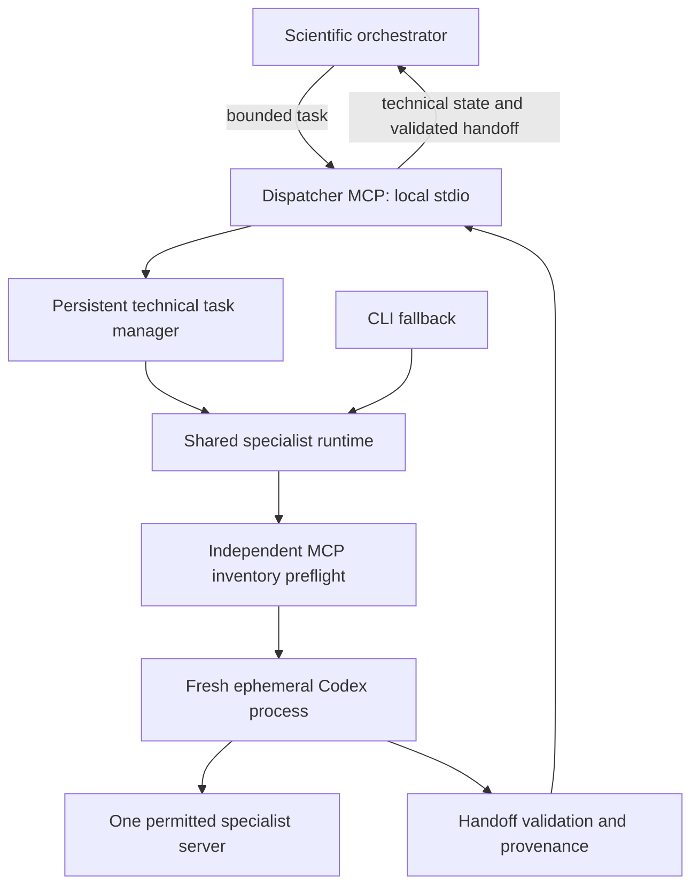

# Specialist dispatcher

The dispatcher is the preferred specialist interface. Phases 0–8 are complete in this WSL workspace. The shared-runtime CLI remains the supported fallback.
Scientific approval gates remain unchanged; the completed live test does not
establish biological validity. See the [tool and startup guide](../scripts/codex/dispatcher/README.md).

## Phase 0 — baseline (2026-09-15)

Implementation follows the supplied **Specialist Dispatcher Architecture** plan,
sequentially. Orchestrator routing may change only after Phase 4 isolation and
equivalence checks pass. Each completed phase receives its own commit.

- Starting commit: `dfee97fd46581fbcf4561a7e089ea5ab3e62b048` on `main`.
- Working branch: `codex/specialist-dispatcher`.
- Unrelated untracked files preserved: `inputs/287D_PS_stats.txt:Zone.Identifier`,
  `pypath_log/`, and `runs/network-curator/`.
- Baseline: `python3 scripts/run_tests.py` passed 100 Codex, 19 Claude, and
  26 setup tests (145 total).
- Required runtime: Python 3.11+, Codex CLI 0.153.0+.
- Inspected environment: Python 3.14.4, Codex CLI 0.154.0; the default Python
  interpreter does not have the MCP SDK installed.
- Reviewed launcher, configuration, provenance, streaming, profile examples,
  plugin manifest, launcher documentation, and regression suite.
- Plugin currently contributes skills only; it bundles no MCP transports.
- Root configuration disables NeKo, MaBoSS, and PhysiCell with inert transports.

## Preserved launcher invariants

Every invocation creates a fresh `codex exec --ephemeral` process with a bounded
task, a fixed specialist profile, and a read-only sandbox. There is no resumption
or forwarding of orchestrator history or other specialist transcripts.

The same resolved executable, environment, working directory, profile transport,
and fixed MCP overrides are used for inventory preflight and execution. Unexpected
enabled servers fail closed. Each modelling role gets exactly its own server;
literature gets an approved backend and no modelling server. Exact tool approvals
remain scoped to the permitted server; destructive tools stay disabled.

JSONL events retain existing redaction and malformed-event checks. A zero process
exit alone is insufficient: identity, lineage, typed handoff validation, and
provenance recording must pass. Scientific handoff status remains distinct from
technical execution state.

Artifacts remain under `runs/<specialist>/<session>/specialist-invocations/`,
with `_launcher-runs` staging. The CLI and Windows-to-WSL bridge remain supported.
Disposable task-file cleanup remains available for the CLI fallback.

## Migration gates

| Phase | Scope | Status |
| --- | --- | --- |
| 0 | Baseline and invariants | Passed |
| 1 | Shared runtime, unchanged CLI protections | Passed |
| 2 | Persistent task manager and fake-worker tests | Passed |
| 3 | Local MCP server and protocol tests | Passed |
| 4 | Root isolation, live specialist smoke tests, CLI equivalence | Passed |
| 5 | Orchestrator and skill routing | Passed after Phase 4 |
| 6 | Same-conversation ChatGPT observability | Passed in WSL desktop conversation |
| 7 | Bounded real scientific operation | Passed with parent artifact persistence |
| 8 | Cleanup and preferred-path documentation | Complete after Phase 7 |

No scientific state, scientific policy, Claude implementation, or routing changes
are part of Phase 0.

## Phase 1 — shared runtime

The CLI now adapts arguments to `SpecialistInvocationRequest` and calls
`specialist_runtime.executor.execute()` directly. Results carry execution state,
validated handoff, errors, timestamps, and artifact paths. Compatibility helper
exports and the Windows-to-WSL CLI remain available. Security-relevant command
construction and the existing validators are unchanged.

Validation: 106 Codex, 19 Claude, and 26 setup tests passed (151 total). Added
request-boundary, fresh-ID, command-boundary, preflight-failure, and blocked-handoff
status tests; existing native execution mocks now target the extracted module.

Live CLI inventory inspection passed on Codex 0.154.0, with a validated typed
blocked handoff (no scientific work requested), exit 0, and recorded provenance:
`runs/network-curator/_blocked/specialist-invocations/2026-09-15T024253-9029ba54-cddb-4100-a598-b50c4206329e/`.
The child observed NeKo and no MaBoSS/PhysiCell; no modelling tools were called.

Environment findings: the desktop inherits a Windows Codex home without the
specialist profiles. Native WSL checks must use the existing Linux home (the test
removed the inherited `CODEX_HOME` for that command only). Inventory checks passed
for all four Linux profiles and the root had no enabled modelling servers. PubMed
is not configured. The first child attempt failed because the enclosing sandbox
made Codex's state directory read-only; it was preserved under `_unresolved` with
invocation ID `2026-09-15T024233-42482320-c91a-4b6e-bd6a-473d8c5d9b69`. The successful
retry had permission to initialize Codex's local state; the specialist retained
its read-only sandbox and isolation overrides. No global settings were changed.

## Phase 2 — persistent task manager

Task input is durably recorded before preflight. The file-backed `.dispatcher/`
registry uses atomic replacements, file and directory synchronization, a single
process lease, and strict IDs/path containment. Runtime callbacks report technical
state, inventory verification, tool activity, and heartbeat events. Terminal
success requires handoff validation and provenance. A scientific `blocked`
handoff can still be a successful technical execution.

The dispatcher limits modelling to one active worker globally and literature to
two. Cancellation signals only managed children through the existing streaming
mechanism. Preflight subprocesses have a 30-second deadline; cancellation during
preflight is acted on before scientific execution. Shutdown retains its lease if
workers have not stopped. On restart, transient records become failed and are
never resumed or retried. Partial artifacts remain available. A corrupt task
record is reported individually.

Operational events live in `.dispatcher/events/<task-id>.jsonl`; raw sanitized
Codex JSONL remains in the established invocation `events.jsonl`. This chooses
the plan's separate-stream option to avoid mixing public progress with raw
transcript/reasoning events. Queries return only the operational projection, not
raw command arguments, search queries, tool results, or reasoning. Registry data
is operational metadata and never replaces scientific state.

Validation: 120 Codex, 19 Claude, and 26 setup tests passed (165 total). New tests
exercise every state transition, atomic-write failure, corrupt records, symlink
escapes, restart recovery, concurrent ownership, concurrency caps, redaction,
pagination, and actual fake-Codex subprocesses. Integration cases cover a valid
handoff, malformed JSONL, invalid handoff, nonzero process exit, recording failure,
unsafe inventory, active-tool progress, heartbeats, and cancellation.

## Phase 3 — MCP server

The official MCP SDK 2.0.0 was already installed in the modelling environment.
The server uses its low-level stdio API and Pydantic's strict input validation;
unknown tools and extra arguments fail before task creation. The only dependency
is `mcp>=2.0.0,<3` (which supplies Pydantic). No network listener, external queue,
or new model-execution wrapper was introduced.

The [official SDK server contract](https://py.sdk.modelcontextprotocol.io/advanced/low-level-server/)
requires applications to validate low-level tool arguments themselves. Our strict
models enforce that boundary and produce schemas with `additionalProperties=false`.

Validation: 124 Codex, 19 Claude, and 26 setup tests passed (169 total) using the
SDK environment. Tests exercise MCP initialization, all eight tool schemas,
forbidden inputs, error results, asynchronous start/query/cancel calls, actual
stdio subprocess transport, clean disconnect, and lease release. A separate CI
job installs the SDK so these tests cannot disappear behind optional skips.

Orchestrator instructions and the installed plugin remain unchanged. Server
configuration and live equivalence are the next phase, not implied by passing
protocol tests.

## Phase 4 — local integration and completed isolation gate

The root configuration now exposes a required local stdio dispatcher. The bootstrap
uses the existing ignored installer settings or explicit ignored dispatcher
settings, without committing workstation paths. NeKo, MaBoSS, PhysiCell, and the
unexpected user-global BioMASS modelling server are disabled for this project.
The verified root inventory has only `specialist_dispatcher` enabled. Global
configuration and the Claude implementation were not changed.

The first live run discovered that Codex 0.154.0 exposes built-in `codex_apps`
connectors outside `codex mcp list`. Their presence failed the strict live
namespace check. Both preflight and execution now receive fixed
`features.apps=false` and a disabled dispatcher override. The
[official configuration reference](https://learn.chatgpt.com/docs/config-file/config-reference)
documents the app feature flag and required MCP startup behavior. This tightens
the execution boundary without changing scientific policy or adding a backend.

After the fix, fresh live processes reported:

| Specialist | Observed MCP namespace | Result |
| --- | --- | --- |
| Network curator | `neko` only | Passed |
| Boolean dynamics modeller | `maboss` only | Passed |
| Multicellular configurator | `physicell` only | Passed |
| Literature reviewer | No MCP namespace; authorized web search available | Passed |

The three live modelling tests made no MCP/modelling calls, created no scientific
sessions, and returned validated inspection-only blocked handoffs. The literature
request exercised the expected fail-closed path: a recorded blocked handoff with
no child launch. This is **not** counted as a passed live literature context test.
The researcher has been asked to authorize web search solely for the inventory
smoke test (no search call), or provide a configured PubMed backend. The initial attempt remained blocked until authorization was received.
The researcher subsequently authorized the inventory-only web-search test. Its
fresh child observed no MCP namespace, reported web search available, made no web
or modelling calls, and returned a validated handoff with recorded provenance.
All four live context checks now pass; the Phase 4 gate is complete.

A matched real CLI invocation passed all 23 equivalence checks against the
corrected dispatcher network inspection: identity/profile, binary hash/version,
complete MCP inventory, disabled apps, read-only sandbox, ephemeral execution,
exact task hash, approvals, search settings, exit semantics, sanitized events,
validated handoff, provenance, and expected artifacts. Invocation IDs were distinct.
All six scientific source-of-truth files retained their hashes.

Validation: 127 Codex, 19 Claude, and 26 setup tests passed (172 total), with all
MCP SDK tests enabled. The stdlib-only fallback also passed with four SDK protocol
tests explicitly skipped. A partial operational event written before a crash is
now isolated during recovery and cannot prevent other task records from loading.

[Machine-readable validation record](specialist-dispatcher-phase4-validation.json)
contains exact task and invocation IDs, artifact directories and hashes, corrected
root inventory, preserved initial failures, and the CLI equivalence results.
Raw invocation artifacts remain at those local paths; they are not bundled into
the code commit.

## Phase 5 — orchestrator routing

Completed after the Phase 4 isolation gate passed (commit `90e9479`). AGENTS and
all five routing skills now use the dispatcher start/status/event tools, distinguish
execution success from scientific status, and retain the shared-runtime CLI fallback.
Scientific policy, stage gates, shared state, and Claude implementation are unchanged.
Validation: 127 Codex, 19 Claude, and 26 setup tests passed; all five changed skills
passed the skill-creator validator.

## Phase 6 — completed in the branched desktop conversation

The WSL local plugin was refreshed from the verified repository marketplace with
`codex plugin add agentic-system-for-modelling@agentic-modelling-local`, using
`CODEX_HOME=/home/marcorusc/.codex`. Structured plugin listing confirms version
`0.1.0+codex.20260915040240`, enabled, with this repository as its local source.
The manifest passes the plugin-creator validator. The plugin remains skills-only;
the project `.codex/config.toml` owns the dispatcher transport so execution stays
bound to the working repository rather than a cached plugin copy.

The original desktop conversation had no callable dispatcher tools. Its available
tool inventory contains no direct NeKo, MaBoSS, or PhysiCell tools, but that alone
does not pass Phase 6. There is no exposed tool to reload this conversation's MCP
inventory. The Windows-side cached plugin is still the older version; native CLI
listing attempts did not resolve its registration, so the Windows cache was not
edited or reported as refreshed. WSL installation is verified; native Windows
installation was not verified.
The same-workspace branched conversation resolved tool loading as recorded below.

### Phase 6 verification result

On 2026-09-15, branching the conversation in the same WSL workspace loaded all eight
dispatcher tools, with no direct modelling MCP tools. The root called
`start_network_curator`, queried events at cursors 0, 5, and 11, and received the
validated handoff through `get_specialist_task` in that same conversation.
Task `35048b9e9f424fb89a7c67a103c4ad9e` succeeded technically; its scientific status
was correctly `blocked` because only inventory inspection was requested. The
preflight and specialist observation agreed: NeKo enabled; MaBoSS, PhysiCell,
BioMASS, PubMed, and recursive dispatcher access disabled. All six scientific file
hashes are unchanged, and the JSONL contains no modelling or search calls.

[Phase 6 evidence](specialist-dispatcher-phase6-validation.json) records the task,
invocation, artifact hashes, and cursor sequence. This passes the desktop workflow
gate for this workspace; the earlier reload blocker is resolved. No native Windows
host claim is made.

## Phase 7 — real source-import attempt blocked

On 2026-09-15 the researcher authorized proceeding with the bounded benchmark.
The dispatcher launched a fresh NeKo specialist, verified isolation, and returned
source verification for the pinned PhysiBoSS topology (90 nodes, 387 functional
edges). Session `31b5cbb8-4161-4f04-8796-37067069b3fc` was created and verified empty.
The single source-only SIF import timed out after 300 seconds. No export or topology
comparison was obtained. No retry, model substitution, or repair was attempted.

Task `eea21797ded6449cbd653c1fd45eb2c8` completed technically with a validated
scientific `failed` handoff, correctly distinguishing successful result delivery
from a successful scientific operation. Both original child processes subsequently
exited. Preserve the session identifier as provenance; do not assume runtime state
survives. All six shared scientific files remain unchanged.

[Phase 7 failure evidence](specialist-dispatcher-phase7-validation.json) records
hashes, calls, parameters, and validation failures. The source input, audit,
derivation script, and failure report were preserved under the session run directory.
The [timeout diagnosis](neko-phase7-timeout-diagnosis.md) records the available
evidence and remaining uncertainty. The researcher superseded this test design
with the gene-based construction below.

### Revised Phase 7 direction — de novo construction

The researcher clarified that the intended test starts from genes comparable to
Sizek, builds a new network and Boolean model, and compares its behavior with the
published models. The direct-SIF import approach is superseded, not repaired or
retried. Its failure evidence remains intact. The current
[Phase 7 proposal](phase7-benchmark-proposal.md) provides a complete component map,
the approved 60-gene first pass, explicit omissions, and SIGNOR construction
policies. Its completed technical validation follows; scientific acceptance
and downstream work remain separately gated.

### Phase 7 completion — approved de novo construction

The researcher approved the exact 60-gene SIGNOR first pass on 2026-09-15.
Task `af9cdb6a6b8e45ccbc1d327b5c4a2863` created fresh session
`d63363b6-59b4-47cf-adae-6b9110e438fd`, constructed 151 edges without connector
genes, inspected coverage/history/connectivity/references, and exported its SIF.
All NeKo calls succeeded; progress was visible through dispatcher events.

The original scientific handoff reported `failed` because its local Python hash
command was unavailable and repository artifacts were still drafts. The parent
used the established [persistence contract](handoff-validation.md) to independently
verify the existing SIF and write the reports, queue, full node list, and manifest.
A separate orchestrator result passes the completed-artifact validator. The original
failed result is preserved; no modelling operation was retried or result rewritten.

[De novo validation evidence](specialist-dispatcher-phase7-denovo-validation.json)
records exact IDs, hashes, findings, and parent resolution. All six shared scientific
files remain unchanged. Phase 7's technical gate passes; topology and biological
validity remain unapproved, with no BNET export or downstream session. Phase 8 may
now proceed. The earlier import failure remains historical evidence.

## Phase 8 — documentation cleanup complete

Completed after Phase 7 passed. The migration table now reflects verified status,
superseded setup instructions have been removed, and the preferred dispatcher path
links to one tool/startup guide. The CLI, Windows bridge, legacy implementation,
and verified task-file cleanup are retained. No scientific policy changed.
Validation: completed Phase 7 artifact validation and `git diff --check` passed.
No runtime code changed in this phase; the 172-test Phase 5 regression result remains
the latest full suite run.

## Troubleshooting and recovery

- **Dispatcher tools absent:** verify the project transport, SDK interpreter, and
  native Codex home using the startup guide. Reload into a conversation on the same
  workspace, then check the actual root inventory. A working CLI does not prove
  that the desktop loaded the tools. Direct modelling tools in the root are a blocker.
- **Task still running:** use `get_specialist_events` with the last sequence cursor
  and `get_specialist_task` for state. Heartbeats report activity, not success.
  Cancel through `cancel_specialist_task`; do not kill arbitrary processes.
- **Interrupted server:** preserve `.dispatcher/` and invocation artifacts. Restart
  marks interrupted work failed and never resumes it automatically. Inspect partial
  artifacts before an explicitly requested replacement invocation.
- **Technical success, scientific failure:** read the typed result and checks.
  Technical delivery alone cannot authorize a stage transition. Preserve the original
  result. If only report persistence or local file verification remains, the parent
  can resolve that under the [artifact contract](handoff-validation.md), recording a
  separate validated result. Failed modelling operations require diagnosis and a
  separately authorized invocation; do not relabel them as successful.
- **CLI fallback:** use `scripts/codex/run_specialist.py` through the same runtime and
  fixed profile. Only this path needs a project-contained `.codex-tasks/` prompt
  file; dispatcher starts accept structured task text and persist it automatically.
  `scripts/codex/cleanup_tasks.py` retains preview and verified-leftover cleanup for
  legacy prompts. Do not remove unmatched prompts or scientific artifacts.
- **Rollback:** disable the dispatcher transport, retain disabled root modelling
  servers, and use the CLI. Keep profiles, sessions, histories, and task records.

The bounded test's run artifacts remain local under the recorded session paths;
committed validation records pin their hashes. They are not bundled into the code
refactor. Literature review, topology approval, Boolean dynamics, and comparison
against the published reference remain outstanding scientific work.

## Subsequent curation findings

The single-invocation smoke test does not establish live session continuity across
ephemeral specialists. [Curation follow-up](neko-curation-continuity.md) records the
observed session-lifetime and targeted-preview limitations, a rejected reconstruction
handoff, and the tested JSON-safe redaction fix. Scientific curation remains pending.
