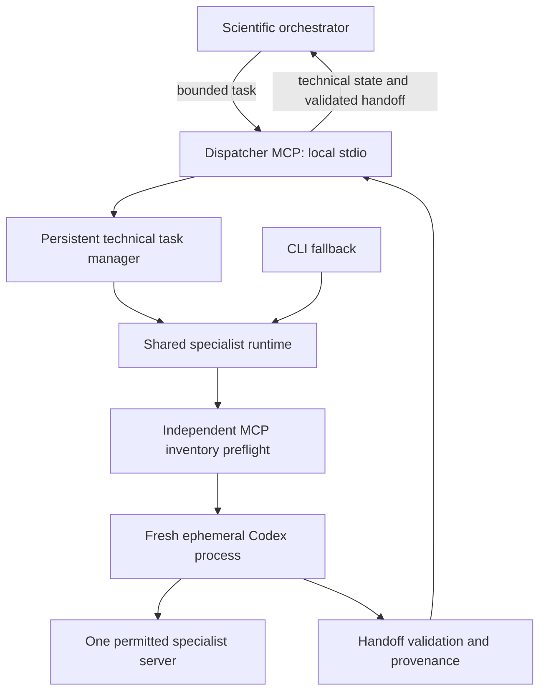

# Specialist dispatcher migration

## Phase 0 — baseline (2026-09-15)

Implementation follows the supplied **Specialist Dispatcher Architecture** plan,
sequentially. Orchestrator routing may change only after Phase 4 isolation and
equivalence checks pass. Each completed phase receives its own commit.

- Starting commit: `dfee97fd46581fbcf4561a7e089ea5ab3e62b048` on `main`.
- Working branch: `codex/specialist-dispatcher`.
- Unrelated untracked files preserved: `inputs/287D_PS_stats.txt:Zone.Identifier`,
  `pypath_log/`, and `runs/network-curator/`.
- Baseline: `python3 scripts/run_tests.py` passed 100 Codex, 19 Claude, and
  26 setup tests (145 total).
- Required runtime: Python 3.11+, Codex CLI 0.153.0+.
- Inspected environment: Python 3.14.4, Codex CLI 0.154.0; the default Python
  interpreter does not have the MCP SDK installed.
- Reviewed launcher, configuration, provenance, streaming, profile examples,
  plugin manifest, launcher documentation, and regression suite.
- Plugin currently contributes skills only; it bundles no MCP transports.
- Root configuration disables NeKo, MaBoSS, and PhysiCell with inert transports.

## Preserved launcher invariants

Every invocation creates a fresh `codex exec --ephemeral` process with a bounded
task, a fixed specialist profile, and a read-only sandbox. There is no resumption
or forwarding of orchestrator history or other specialist transcripts.

The same resolved executable, environment, working directory, profile transport,
and fixed MCP overrides are used for inventory preflight and execution. Unexpected
enabled servers fail closed. Each modelling role gets exactly its own server;
literature gets an approved backend and no modelling server. Exact tool approvals
remain scoped to the permitted server; destructive tools stay disabled.

JSONL events retain existing redaction and malformed-event checks. A zero process
exit alone is insufficient: identity, lineage, typed handoff validation, and
provenance recording must pass. Scientific handoff status remains distinct from
technical execution state.

Artifacts remain under `runs/<specialist>/<session>/specialist-invocations/`,
with `_launcher-runs` staging. The CLI and Windows-to-WSL bridge remain supported.
Disposable task-file cleanup remains available for the CLI fallback.

## Migration gates

| Phase | Scope | Status |
| --- | --- | --- |
| 0 | Baseline and invariants | Passed |
| 1 | Shared runtime, unchanged CLI protections | Passed |
| 2 | Persistent task manager and fake-worker tests | Passed |
| 3 | Local MCP server and protocol tests | Passed |
| 4 | Root isolation, live specialist smoke tests, CLI equivalence | Pending |
| 5 | Orchestrator and skill routing | Gated on Phase 4 |
| 6 | Same-conversation ChatGPT observability | Pending |
| 7 | Bounded real scientific operation | Pending |
| 8 | Cleanup and preferred-path documentation | Gated on real operation |

No scientific state, scientific policy, Claude implementation, or routing changes
are part of Phase 0.

## Phase 1 — shared runtime

The CLI now adapts arguments to `SpecialistInvocationRequest` and calls
`specialist_runtime.executor.execute()` directly. Results carry execution state,
validated handoff, errors, timestamps, and artifact paths. Compatibility helper
exports and the Windows-to-WSL CLI remain available. Security-relevant command
construction and the existing validators are unchanged.

Validation: 106 Codex, 19 Claude, and 26 setup tests passed (151 total). Added
request-boundary, fresh-ID, command-boundary, preflight-failure, and blocked-handoff
status tests; existing native execution mocks now target the extracted module.

Live CLI inventory inspection passed on Codex 0.154.0, with a validated typed
blocked handoff (no scientific work requested), exit 0, and recorded provenance:
`runs/network-curator/_blocked/specialist-invocations/2026-09-15T024253-9029ba54-cddb-4100-a598-b50c4206329e/`.
The child observed NeKo and no MaBoSS/PhysiCell; no modelling tools were called.

Environment findings: the desktop inherits a Windows Codex home without the
specialist profiles. Native WSL checks must use the existing Linux home (the test
removed the inherited `CODEX_HOME` for that command only). Inventory checks passed
for all four Linux profiles and the root had no enabled modelling servers. PubMed
is not configured. The first child attempt failed because the enclosing sandbox
made Codex's state directory read-only; it was preserved under `_unresolved` with
invocation ID `2026-09-15T024233-42482320-c91a-4b6e-bd6a-473d8c5d9b69`. The successful
retry had permission to initialize Codex's local state; the specialist retained
its read-only sandbox and isolation overrides. No global settings were changed.

## Phase 2 — persistent task manager

Task input is durably recorded before preflight. The file-backed `.dispatcher/`
registry uses atomic replacements, file and directory synchronization, a single
process lease, and strict IDs/path containment. Runtime callbacks report technical
state, inventory verification, tool activity, and heartbeat events. Terminal
success requires handoff validation and provenance. A scientific `blocked`
handoff can still be a successful technical execution.

The dispatcher limits modelling to one active worker globally and literature to
two. Cancellation signals only managed children through the existing streaming
mechanism. Preflight subprocesses have a 30-second deadline; cancellation during
preflight is acted on before scientific execution. Shutdown retains its lease if
workers have not stopped. On restart, transient records become failed and are
never resumed or retried. Partial artifacts remain available. A corrupt task
record is reported individually.

Operational events live in `.dispatcher/events/<task-id>.jsonl`; raw sanitized
Codex JSONL remains in the established invocation `events.jsonl`. This chooses
the plan's separate-stream option to avoid mixing public progress with raw
transcript/reasoning events. Queries return only the operational projection, not
raw command arguments, search queries, tool results, or reasoning. Registry data
is operational metadata and never replaces scientific state.

Validation: 120 Codex, 19 Claude, and 26 setup tests passed (165 total). New tests
exercise every state transition, atomic-write failure, corrupt records, symlink
escapes, restart recovery, concurrent ownership, concurrency caps, redaction,
pagination, and actual fake-Codex subprocesses. Integration cases cover a valid
handoff, malformed JSONL, invalid handoff, nonzero process exit, recording failure,
unsafe inventory, active-tool progress, heartbeats, and cancellation.

## Phase 3 — MCP server

The official MCP SDK 2.0.0 was already installed in the modelling environment.
The server uses its low-level stdio API and Pydantic's strict input validation;
unknown tools and extra arguments fail before task creation. The only dependency
is `mcp>=2.0.0,<3` (which supplies Pydantic). No network listener, external queue,
or new model-execution wrapper was introduced.

The [official SDK server contract](https://py.sdk.modelcontextprotocol.io/advanced/low-level-server/)
requires applications to validate low-level tool arguments themselves. Our strict
models enforce that boundary and produce schemas with `additionalProperties=false`.

Validation: 124 Codex, 19 Claude, and 26 setup tests passed (169 total) using the
SDK environment. Tests exercise MCP initialization, all eight tool schemas,
forbidden inputs, error results, asynchronous start/query/cancel calls, actual
stdio subprocess transport, clean disconnect, and lease release. A separate CI
job installs the SDK so these tests cannot disappear behind optional skips.

Orchestrator instructions and the installed plugin remain unchanged. Server
configuration and live equivalence are the next phase, not implied by passing
protocol tests.
